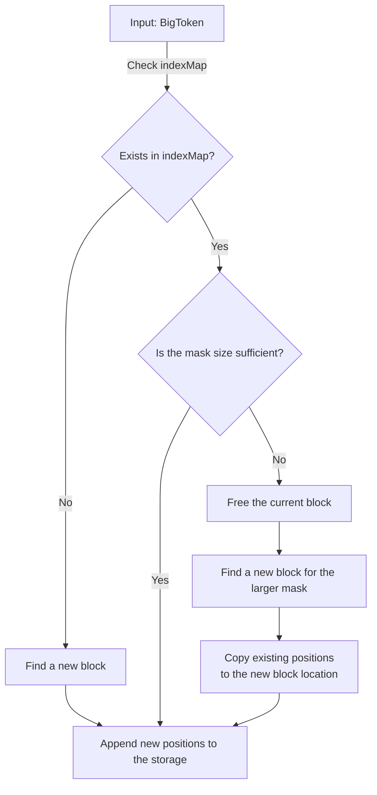

# IndexStorage
## Table of Contents
<!-- TOC -->
* [IndexStorage](#indexstorage)
  * [Table of Contents](#table-of-contents)
  * [Overview](#overview)
  * [Single approach](#single-approach)
    * [Idea](#idea)
    * [Pros and Cons](#pros-and-cons)
    * [](#)
  * [Multi approach](#multi-approach)
<!-- TOC -->
## Overview
A module for storing the reverse index of the text. Interface of the class:
```c++
/**
 * @brief Creates an index from the given data.
 *
 * @param data A map where keys are strings and values are BigToken objects.
 */
virtual void createIndex(std::unordered_map<std::string, BigToken>& data) = 0;
/**
 * @brief Retrieves the raw index from the files by given token bodies.
 *
 * @param bodies A string representing the body of token.
 * @param[out] output A vector of references to PosMap where results will be stored.
 */
virtual void getRawIndex(const std::string& body, std::vector<PosMap>&) = 0;
/**
* @brief Closes all file streams and flush data.
*/
virtual void close() = 0;
/**
* @brief Save static index metadata into files.
*/
virtual void saveStorageMeta() = 0;
/**
* @brief Load static index metadata into internal structures.
*/
virtual void loadStorageMeta() = 0;
```
### How to create index
```c++
#include "storages/indexes/multi/multiFileIndexStorage.h"
#include "storages/indexes/single/singleIndexStorage.h"
...

// Prepare example
std::unordered_map<std::string, BigToken> data;

BigToken bigToken1("myToken_1");
FileId fileId1 = 1;
TokenInfo tokenInfo1 = {10, 12};
bigToken1.addPosition(fileId1, tokenInfo1);

FileId fileId2 = 2;
TokenInfo tokenInfo2 = {723, 41};
BigToken bigToken2("myToken_2");
bigToken2.addPosition(fileId2, tokenInfo2);

data[bigToken1.getBody()] = bigToken1;
data[bigToken2.getBody()] = bigToken2;
// ---
IIndexStorage *indexStorage = new MultiFileIndexStorage();

indexStorage->loadStorageMeta();

indexStorage->createIndex(data);

indexStorage->close();
indexStorage->saveStorageMeta();

...
```
### How to get index
```c++
#include "storages/indexes/multi/multiFileIndexStorage.h"
#include "storages/indexes/single/singleIndexStorage.h"
...

IIndexStorage *indexStorage = new MultiFileIndexStorage();

indexStorage->loadStorageMeta();

std::string token_to_find = "myToken_1";
std::vector<PosMap> results;
indexStorage->getRawIndex(token_to_find, results);

indexStorage->close();

...
```
## Single approach
### Overview
The core idea is to store the index in a single file.


### Pros and Cons
**Pros:**
- Working with a single file → no significant delays from opening multiple files

**Cons:**
- File compression complexity. Frequent index updates create empty blocks
that need to be tracked and compressed.

### Implementation
Two files are created:
1. Index metadata
2. The index itself

#### Metadata file
Describes the index file.
Consists of two hash tables:
1. A map <blockStart, blockCount> that stores the starting position of free space 
and its size in base blocks (16 tokens per block).
2. A map `<token_body, (blockMask, blockStart, bytesSize)>`:
   - `blockMask`: Determines the block size. Blocks can have different lengths to efficiently 
store tokens of varying frequency.
   - `blockStart`: Marks the starting position (in base blocks) 
of a free space segment of size blockMask.

#### Index file
A byte-encoded file storing triples `(uint_64, uint_64, uint_64)` representing (fileId, pos, posWord).
If an index block exceeds its allocated space during an update, it expands to the next block size.

## Multi approach