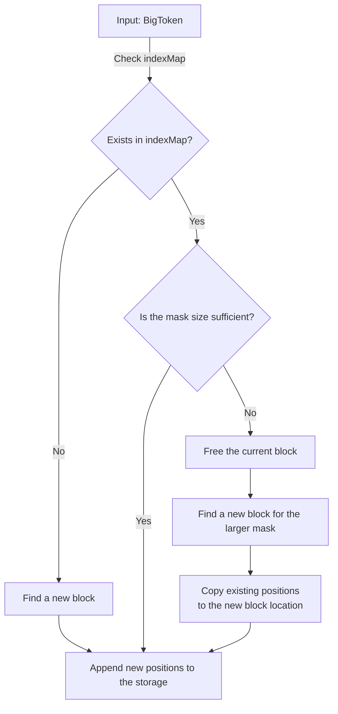

# IndexStorage
## Table of Contents
<!-- TOC -->
* [IndexStorage](#indexstorage)
  * [Table of Contents](#table-of-contents)
  * [Overview](#overview)
  * [Single approach](#single-approach)
    * [Idea](#idea)
    * [Pros and Cons](#pros-and-cons)
    * 
  * [Multi approach](#multi-approach)
<!-- TOC -->
## Overview
_< description >_

## Single approach
### Overview
The core idea is to store the index in a single file.

### Pros and Cons
**Pros:**
- Working with a single file → no significant delays from opening multiple files

**Cons:**
- File compression complexity. Frequent index updates create empty blocks
that need to be tracked and compressed.

### Implementation
Two files are created:
1. Index metadata
2. The index itself

#### Metadata file
Describes the index file.
Consists of two hash tables:
1. A map <blockStart, blockCount> that stores the starting position of free space 
and its size in base blocks (16 tokens per block).
2. A map `<token_body, (blockMask, blockStart, bytesSize)>`:
   - `blockMask`: Determines the block size. Blocks can have different lengths to efficiently 
store tokens of varying frequency.
   - `blockStart`: Marks the starting position (in base blocks) 
of a free space segment of size blockMask.

#### Index file
A byte-encoded file storing triples `(uint_32, uint_32, uint_32)` representing (fileId, pos, posWord).
If an index block exceeds its allocated space during an update, it expands to the next block size.

## Multi approach